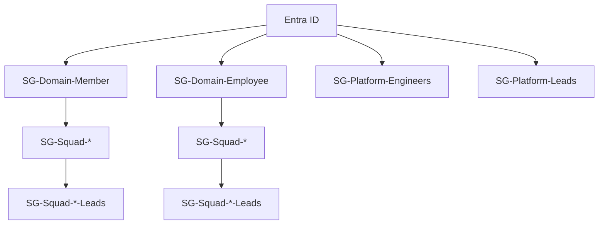
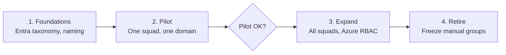

# Identity-First Access Model

*As of 2026-09-30.*

Replacing today's ticket-based ADO group creation with Entra ID as the single source of truth for access across Azure DevOps and Azure, covering multiple squads across the Member and Employee digital services.

---

## Overview

Entra ID becomes the only place anyone is added to or removed from an access group. Azure DevOps and Azure RBAC both just reflect whatever Entra says, and a ServiceNow ticket is the only front door for changing membership. Four group layers do different jobs:

- **Squad groups (`SG-Squad-{Name}`)** are the base unit of delivery — day-to-day Contributor rights on the squad's own repo(s), Reader everywhere else in the project. Most engineers belong to exactly one of these.
- **Squad lead groups (`SG-Squad-{Name}-Leads`)** are a small elevation layer on top of squad membership — Build Administrator and Environment Approver, scoped to that squad's own pipelines and environments only. Leads don't get a different repo permission; they get two extra ADO capabilities ordinary squad members don't.
- **Domain groups (`SG-Domain-Member`, `SG-Domain-Employee`)** are pure organisational grouping, not a permission grant. Squad groups nest inside them. They exist so "who's in the Member domain" has an answer that doesn't imply any access, and so a domain-wide action has a natural audience.
- **Platform groups (`SG-Platform-Engineers`, `SG-Platform-Leads`)** sit outside the squad/domain hierarchy entirely — the people who run the shared platform (pipeline templates, hub network, landing zone vending) rather than deliver a squad's own product.

Provisioning is one motion regardless of layer: a ServiceNow ticket creates (or adds someone to) the Entra group; Azure DevOps and Azure follow automatically because both sync from — or reference — that same group. The one branch: adding someone to a **Leads** or **Platform** group routes to Platform/Security for approval, not through the delivery manager who'd approve ordinary squad membership. That split is what gives this model separation of duties — elevation is never self-service and never approved by the same person requesting it.

One more piece, resolved after review: squads get Reader on their own landing zone subscription in Azure — visibility, never standing Contributor or Owner. Anything that changes a landing zone runs through that squad's own CI identity instead: a workload-identity-federated pipeline service principal, no stored secret, holding Contributor there and nowhere else. See the Permission Matrix and Open Decision #9.

---

## Entra Group Catalog

Six groups, four layers — everything else in Azure DevOps and Azure is a reflection of these.

*`*` = squad name; the Squad/Leads shape shown once per domain repeats for every squad.*

| Entra Group | Layer | Who's In It | ADO Mapping | Azure RBAC Mapping |
|---|---|---|---|---|
| `SG-Squad-{Name}` | Squad | All engineers delivering that squad's product | Project: Reader (via domain nesting). Repo: Contributor on the squad's own repo(s) only | Reader on the squad's own landing zone subscription |
| `SG-Squad-{Name}-Leads` | Squad lead | Tech/delivery leads for that squad | Build Administrator + Environment Approver, scoped to that squad's pipeline folder and environments only | Reader on the squad's own landing zone subscription |
| `SG-Domain-Member` | Domain | No direct members — populated entirely by nesting every Member squad group | None directly assigned. Source of the project-level Reader default for Member-domain projects | None |
| `SG-Domain-Employee` | Domain | Same, for Employee squads | Same pattern, Employee-domain projects | None |
| `SG-Platform-Engineers` | Platform | Engineers running shared platform infrastructure | Contributor (or Project Administrator) on platform-owned repos: pipeline templates, shared Bicep modules | Contributor on platform subscriptions (hub network, shared tooling) |
| `SG-Platform-Leads` | Platform | Platform leads — own the guardrail policy and approve elevation requests | Same as Platform-Engineers, plus branch-policy and security administration | Owner on platform subscriptions + User Access Administrator, to manage RBAC delegated to squads |

Azure RBAC for `SG-Squad-{Name}` (and its Leads group) is Reader only, on that squad's own landing zone subscription — visibility, not write access. Every change runs through the squad's own CI identity instead (see the Permission Matrix); this was an open decision, now resolved.

---

## Permission Matrix

Every cell below assumes the group's ADO/Azure sync is actually current — see [Where This Model Needs Scrutiny](#where-this-model-needs-scrutiny) for what breaks that assumption. Key Vault columns extend the model as given, which didn't specify vault access: default is no standing human access, least-privilege-first — pipelines' own identities read secrets, not people.

| Group / Role | Own Squad Repo | Other Squads' Repos | Own Pipelines | Other Squads' Pipelines | Own Environments | Other Environments | Own Landing Zone (Azure) | Own Key Vault | Platform Key Vault |
|---|---|---|---|---|---|---|---|---|---|
| `SG-Squad-{Name}` | Contributor | Reader | Run + edit | View only | None (deploys run via pipeline identity) | None | Reader | No standing access | None |
| `SG-Squad-{Name}-Leads` | Contributor (same as squad) | Reader | Build Administrator (own pipeline folder only) | View only | Environment Approver | None | Reader | Reader — metadata only, not secret values | None |
| `SG-Domain-Member` / `SG-Domain-Employee` | — (no direct grant) | — | — | — | — | — | — | — | — |
| `SG-Platform-Engineers` | Contributor (platform repos) | Reader | Contributor (platform pipelines) | View (for support) | N/A | N/A | N/A | N/A | Administrator |
| `SG-Platform-Leads` | Same as Platform-Engineers | Reader | Administrator | View | N/A | N/A | N/A | N/A | Administrator |
| Delivery Manager | Reader | Reader | View only, no edit/run | View only | None | None | None | None | None |
| Cross-squad reader grant (ad hoc) | — | Reader, one specific repo only | — | — | — | — | — | — | — |
| Squad CI identity (pipeline service principal, non-human) | N/A | N/A | N/A — it IS the pipeline | N/A | Runs the deploy; gated by Environment Approver | N/A | Contributor, own landing zone subscription only | Reads secrets at deploy time | None |

---

## Implementation Plan

### 1. Foundations

- Define the Entra group naming convention and who owns each group in Entra itself (Owners field) — see Open Decision #8.
- Configure Azure DevOps → Entra sync for one pilot project only; don't touch any real permissions yet.

### 2. Pilot

- One squad, Member domain. Create its `SG-Squad-*` and `SG-Squad-*-Leads` groups, nest under `SG-Domain-Member`.
- Wire ADO permissions exactly per the model: repo Contributor, project Reader via nesting, branch-policy bypass explicitly denied, Build Administrator scoped to a pipeline folder, Environment Approver on named environments.
- Validate three things before moving on: a squad member sees other squads' repos as Reader and nothing more; removing someone from the Entra group revokes ADO access inside an agreed window; a lead can approve an environment deployment and nothing project-wide.

### 3. Expand

- Roll out the pilot's runbook to remaining Member squads, then Employee squads, one at a time.
- Run legacy ADO groups and new Entra-backed groups in parallel per squad for a fixed window; confirm equivalence before removing the old group's permissions.
- Re-point existing Azure RBAC assignments (currently on named users or ad hoc groups) to the Entra group object IDs directly.
- Cut ServiceNow over: the "new squad member" catalog item creates or updates the Entra group, not an ADO group; a separate catalog item for Leads/Platform elevation routes to Platform/Security approval.

### 4. Retire

- Freeze creation of new manually-managed ADO groups as an org policy.
- Delete legacy ADO groups once their membership is confirmed covered by the equivalent Entra group.
- Stand up a recurring (quarterly) access review of Entra group membership — the one review point this model needs, since ADO/Azure just reflect it.

---

## Open Decisions

| # | Decision | Why It Matters | Lean |
|---|---|---|---|
| 1 | Sync lag handling | Entra→ADO sync and Entra→Azure RBAC propagate at different speeds (see Scrutiny). Offboarding needs a defined "hard stop," not an assumption that group removal is instant | Disable the Entra user account itself as the hard stop; group removal is tidy-up, not the control |
| 2 | ADO nested-group depth | This model nests Squad inside Domain, and Leads effectively a level further — confirm current ADO behaviour for permission evaluation at that depth before relying on it | Pilot it explicitly in Phase 2 before rolling out further |
| 3 | Flatten the domain hierarchy in ADO? | Domain groups could stay a pure Entra construct (each squad group individually granted project Reader) instead of ADO also expecting nested-group expansion | Depends on #2's pilot result |
| 4 | Cross-squad Reader grants | Are these their own small Entra group per grant, or a lighter mechanism? A group-per-grant risks sprawl | Consider time-bound elevation instead of a standing group, once volume is known |
| 5 | VPN group reuse | Is VPN access literally the same group as repo access, or a parallel one? Coupling them means an unrelated access change moves both | Separate `SG-Squad-{Name}-VPN`, same source membership, audited as a distinct grant |
| 6 | Who approves Platform-Leads elevation? | Platform-Leads approves everyone else's elevation — someone still needs to approve elevation *into* that group, and it can't be the group approving itself | A named second approver outside Platform-Leads (e.g. a security lead) |
| 7 | Break-glass access | CIS expects documented elevated access *and* an emergency path faster than a standard approval — the model as given has neither stated | A logged, time-boxed emergency grant, reviewed after the fact, not a standing bypass |
| 8 | Entra group ownership | "Entra is the only place people are added or removed" doesn't say who can do that adding. Owners = delivery managers just moves the manual-ticket problem up one layer | Owners = Platform/Security only; ServiceNow is the only front door |
| 9 | Azure RBAC for the base squad group | The model details ADO permissions precisely but is silent on whether `SG-Squad-{Name}` gets any direct Azure role at all | **Resolved:** Reader on the squad's own landing zone subscription for visibility; all changes go through that squad's pipeline (CI) identity with Contributor — never a human's standing grant |
| 10 | External/contractor accounts | Can every squad member always be a native Entra group member, or do some need guest-account handling that behaves differently in sync? | Confirm per squad before rollout; don't assume uniformity |

---

## Where This Model Needs Scrutiny

Six places the model as written doesn't fully hold up — worth resolving before this goes to build, not after.

1. **Domain groups "carry no direct permissions" contradicts the project-Reader default.** Point 3 says domain groups are ownership-only; point 5 says project Reader is the default. If Reader is granted via the domain group — the natural reading, since squad groups nest inside it — the domain group *does* carry a permission. Either reconcile this explicitly, or grant Reader to each squad group individually and keep the domain group truly permission-free.

2. **"Build Administrator" and "Environment Approver" aren't scoped to one squad by default.** In classic Azure DevOps, Build Administrators is a broad project-level group that can manage every pipeline's security, not just one squad's. Squad-scoped elevation needs the Leads group added to that squad's own pipeline folder security and to that squad's own Environment approver list — per squad, not a single role grant. Skip this and "scoped to that squad only" isn't actually true.

3. **Branch-policy bypass is a separate permission from Contributor, easy to leave open by accident.** "Contributor" doesn't include the ability to bypass required reviews on main — but "Bypass policies when completing pull requests" and "Bypass policies when pushing" are distinct, separately-granted permissions that some default groups carry. Blocking bypass needs an explicit deny on the squad's Contributor group, not an assumption that Contributor alone is safe.

4. **Group removal is not the same as instant offboarding.** Removing someone from an Entra group revokes what a *new* token would carry — it doesn't invalidate a session or access token they're already holding. CIS's "easy offboarding" needs a real hard stop: disabling the Entra user account itself, which forces re-authentication to fail, with group removal as cleanup rather than the control.

5. **ADO and Azure RBAC don't update from Entra at the same speed.** Azure DevOps holds its own synced copy of group membership, pulled on a cycle; Azure RBAC evaluates group membership close to live, against Entra directly. The same Entra change reaches these two surfaces at different times — don't assume "Entra is the source of truth" means both follow in lockstep, and test the actual lag on each before writing an SLA for it (Open Decision #1).

6. **VPN on the same group as repo access risks scope creep, or an awkward coupling.** If `SG-Squad-{Name}` grants both VPN and repo Contributor, removing someone from the squad (say, for a lateral move) pulls both at once — not always what's intended, and confusing in an audit ("why does a repo-access group also grant network access?"). A parallel, clearly-named VPN group sourced from the same membership is cleaner (Open Decision #5).

---

## Default Groups That Bypass the Model

Any Entra-first access model sits on top of groups and roles that exist by default, independent of anything the model documents. Three layers, each with its own defaults worth auditing before trusting the model alone.

### Entra ID Defaults

- **Every group has an Owner**, separate from its membership — usually whoever created it. Owners can add or remove members directly, with no ticket and no approval step. Any "this is the only front door for membership changes" claim only holds if group creation itself is locked to a controlled set of people; otherwise every group's Owner is a second, invisible front door.
- **The baseline directory role every account gets** ("User" in Entra) includes reading basic directory information — other users, other groups' names and membership — tenant-wide, by default, independent of anything a custom access model grants or restricts.

### Azure RBAC Defaults

- **Implicit subscription Owner on creation.** Whoever or whatever creates a subscription can end up with Owner on it unless that's explicitly overridden at creation time — worth checking on every subscription rather than assuming it away.
- **Classic Administrators** (Co-Administrator / Service Administrator) are a legacy admin model that predates RBAC entirely and bypasses it — full control, invisible to any RBAC-based access review. A common audit finding is at least one subscription still carrying one.
- **Inheritance from higher scopes.** A role assigned at a management group or subscription scope applies to every resource under it. A broad role granted higher up the hierarchy (for policy remediation, for centralized logging) is a standing grant on everything below — it has to be audited at the scope it was granted, not rediscovered per resource.

### Azure DevOps Defaults

- **`Contributors` (built-in) defaults to Contribute on every repo in a project**, not just one. If anyone lands in this group directly — rather than only in custom, narrowly-scoped groups — they get broad write access no matter what a custom model says elsewhere.
- **`Build Administrators` (built-in) is project-wide.** Adding a team's leads to this group directly, instead of scoping their elevation via pipeline-folder security, gives them admin over every team's pipelines, not just their own.
- **`Project Valid Users`** (everyone with access to the project) is often what's actually delivering a baseline Reader grant in practice. Worth confirming that's where a "Reader by default" behaviour is coming from, rather than assuming a custom group is doing that work.

---

## Auditor Appendix

Maps to the four CIS themes named in the brief — not a full CIS Controls v8 crosswalk.

| CIS Theme | How the Model Satisfies It | What Still Has to Be True |
|---|---|---|
| Least privilege | Squad Contributor scoped to its own repo(s) only; Leads' extra rights scoped per pipeline folder/environment, not project-wide | Build Administrator/Environment Approver must actually be configured per-squad (see Scrutiny #2) — a project-wide grant breaks this claim |
| Unique IDs | Every grant traces to an individual's Entra object ID through group membership — no shared account, no one-off manual ACL entry | Needs a periodic diff of ADO's actual permissions against "only these Entra groups have explicit access," to catch manual side-grants |
| Access review | One review point — Entra group membership — since ADO/Azure just reflect it | Only true if there's no drift between Entra membership and actual ADO/Azure access (sync lag, manual grants) |
| Separation of duties | Elevation (Leads, Platform) routes to Platform/Security, not the requester's own delivery manager | Needs an answer for who approves elevation *into* Platform-Leads itself (Open Decision #6) — separation of duties has to hold at the top of the chain too |
